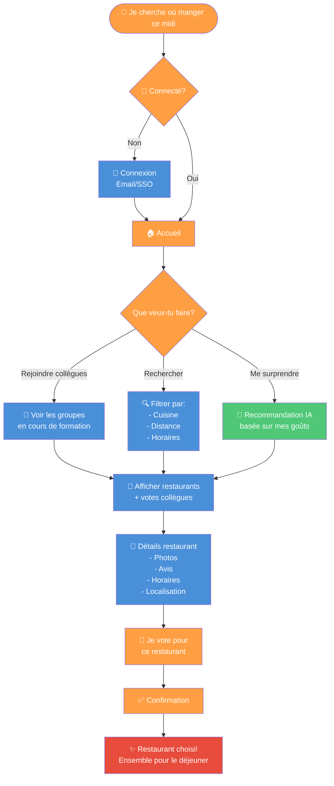

# Claude Code Jumpstart Prompt

En te basant sur le product vision board suivant, la maquette applicative (dans /src) en React et le schéma mermaid ci-dessous, peux-tu faire l'implémentation complète de mon application.

## Stack technique

- **Frontend** : React
- **Backend** : tRPC
- **ORM** : Drizzle
- **Base de données** : Postgres

## Vision :

```json
{
  "projectName": "çaMangeOù ?",
  "vision": [
    "Devenir la plateforme incontournable de décision culinaire collaborative pour les équipes professionnelles",
    "Transformer le choix du restaurant en groupe en une expérience moderne, rapide et sociale"
  ],
  "targetGroup": [
    "Collaborateurs en entreprise cherchant à organiser des déjeuners/dîners de groupe",
    "Équipes de travail de 3 à 20 personnes",
    "Professionnels urbains ayant accès à une variété de restaurants"
  ],
  "needs": [
    "Prendre une décision rapidement sans débat interminable",
    "Voir les choix des collègues en temps réel pour faire un choix informé",
    "Découvrir de nouveaux restaurants plutôt que toujours les mêmes",
    "Filtrer les restaurants par cuisine, distance ou autre critère",
    "Identifier visuellement ses collègues via leurs photos",
    "Historique des choix précédents pour suivi et habitudes",
    "Rejoindre facilement un collègue qui a déjà choisi un restaurant pour ne pas manger seul"
  ],
  "product": [
    "Authentification sécurisée des utilisateurs",
    "Module de choix du restaurant avec 3 modes : (1) Par popularité collègues, (2) Par filtres cuisine/localisation, (3) Par recommandation serendipité",
    "Validation/modification du choix avant confirmation",
    "Écran d'accueil centralisant : modification du choix, avatars collègues, historique récent",
    "Intégration Google Maps/Google Places pour géolocalisation et données restaurants",
    "Système d'avatars/photos de profil pour identification visuelle",
    "Affichage des détails restaurant : avis, horaires, localisation, images",
    "Affichage en temps réel des collègues et leurs choix de restaurant avec option de les rejoindre directement",
    "Système de pastille affichant le nombre de collègues par restaurant sur l'écran d'accueil",
    "Bouton 'Rejoindre' qui met à jour automatiquement le choix de l'utilisateur"
  ],
  "businessGoals": [
    "Créer une communauté d'utilisateurs corporatifs fidélisés",
    "Générer des données comportementales sur les préférences culinaires",
    "Monétiser via partenariats avec restaurants (leads, commissions)",
    "Réduire le time-to-decision pour les réservations de groupe",
    "Augmenter la fréquence des sorties de groupe via la facilitation"
  ]
}
```

## Flowchart Schema


